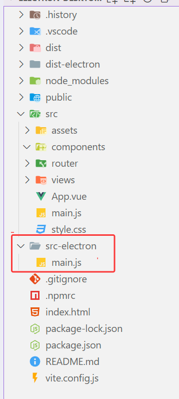

## 用electron+vite+vue3搭建桌面端项目，electron基础配置

### 1. 创建vue项目

```javascript
npm create vite@latest electron-desktop-tool
```

### 2. 进入到项目 执行安装和运行命令

```javascript
  cd electron-desktop-tool
  npm install
  npm run dev
```

### 3. 安装electron

####     ①引入源，在根目录下新建一个 .npmrc文件。

```javascript
strict-ssl=false
registry=https://registry.npmmirror.com/
electron_mirror=https://registry.npmmirror.com/-/binary/electron/
electron_builder_binaries_mirror=https://registry.npmmirror.com/-/binary/electron-builder-binaries/
## ELECTRON_BUILDER_BINARIES_MIRROR=https://mirrors.huaweicloud.com/electron-builder-binaries/ 
```
`strict-ssl=false`：这个设置表示在进行 SSL 连接时不强制验证证书的有效性。这在一些情况下可能会用于避免 SSL 证书验证失败的问题

`registry=https://registry.npmmirror.com/`：这是指定了 npm 的镜像源，用于下载 npm 包

`electron_mirror=https://registry.npmmirror.com/-/binary/electron/`：这个配置项指定了 Electron 包的镜像源，用于下载 Electron 框架相关的二进制文件

#### 	②安装插件

```javascript
// 进入到项目中安装 electron
npm install -D electron
//打包可安装exe程序和绿色版免安装exe程序
npm install -D electron-builder
//开发调试electron
npm install -D electron-devtools-installer
//vite插件
npm install -D vite-plugin-electron
```

### 4.创建项目入口--主进程

① 新建一个`src-electron` 文件用来写electron的代码，在它下面创建一个 `main.js`文件 用来写主进程代码



```javascript
// src-electron/main.js
const { app, BrowserWindow } = require('electron')
const { join } = require('path')

// 屏蔽安全警告
// ectron Security Warning (Insecure Content-Security-Policy)
process.env['ELECTRON_DISABLE_SECURITY_WARNINGS'] = 'true'

// 创建浏览器窗口时，调用这个函数。
const createWindow = () => {
    const win = new BrowserWindow({
        width: 800,
        height: 600,
    })

    // win.loadURL('http://localhost:3000')
    // development模式
    if(process.env.VITE_DEV_SERVER_URL) {
        win.loadURL(process.env.VITE_DEV_SERVER_URL)
        // 开启调试台
        win.webContents.openDevTools()
    }else {
        win.loadFile(join(__dirname, '../dist/index.html'))
    }
}

// Electron 会在初始化后并准备
app.whenReady().then(() => {
    createWindow()
    app.on('activate', () => {
        if (BrowserWindow.getAllWindows().length === 0) createWindow()
    })
})

app.on('window-all-closed', () => {
    if (process.platform !== 'darwin') app.quit()
})
```

② 在**vite.config.ts**中配置`vite-plugin-electron` 插件入口

```javascript
import { defineConfig } from 'vite'
import vue from '@vitejs/plugin-vue'
import electron from 'vite-plugin-electron'

// https://vitejs.dev/config/
export default defineConfig({
    plugins: [
        vue(),
        electron({
            // 主进程入口文件
            entry: './src-electron/main.js'
        })
    ],
    /*开发服务器选项*/
    server: {
        // 端口
        port: 3000,
    }
})

```

③ 配置package.json

在`package.json `把`"type": "module",` 删除掉并且配置main字段

```javascript
// main字段配置为 electron主进程文件路径
"main": "./src-electron/main.js",
```

### 5. vue路由配置(hash模式)

```javascript
// src\router\index.js
import { createRouter, createWebHashHistory } from 'vue-router'

const router = createRouter({
  //  hash 模式
  history: createWebHashHistory(),
  routes: [],
})

export default router
```

### 6. electron启动

运行 `npm run dev` 启动项目

### 7.打包

#### ①配置package.json

在`"scripts"`里面配置打包命令

```java
"electron:build": "vite build && electron-builder"
```

添加一个 `build`属性对象,里面主要配置打包的信息

```javascript
"build": {
    "productName": "ElectronDeskTopTool",
    "appId": "dyy.dongyuanwai",
    "copyright": "dyy.dongyuanwai © 2024",
    "compression": "maximum",
    "asar": true, 
    "directories": {
      "output": "release/" // 输出目录
    },
    "nsis": {
      "oneClick": false,// 是否一键安装
      "allowToChangeInstallationDirectory": true,// 允许修改安装目录
      "perMachine": true,
      "deleteAppDataOnUninstall": true,
      "createDesktopShortcut": true,// 创建桌面图标
      "createStartMenuShortcut": true,// 创建开始菜单图标
      "shortcutName": "ElectronDeskTopTool"
    },
    "win": {
      "icon": "./public/logo.ico",// 安装图标
      "artifactName": "${productName}-v${version}-${platform}-setup.${ext}",//安装包名称
      "target": [
        {
          "target": "nsis"
        }
      ]
    },
    "mac": {
      "icon": "./public/logo.ico",
      "artifactName": "${productName}-v${version}-${platform}-setup.${ext}"
    },
    "linux": {
      "icon": "./public/logo.ico",
      "artifactName": "${productName}-v${version}-${platform}-setup.${ext}"
    }
  },

```

用 `process.env.VITE_DEV_SERVER_URL`来判断是否是开发模式

打完包之后就会加载index.html文件

#### ②win打包（注意---需要管理员权限）

命令行运行`npm run electron:build`

#### ③说明

##### build相关配置

```javascript
// 打包的配置都放到 build里
"build": {  
    "productName":"ElectronDeskTopTool",//项目名 这也是生成的exe文件的前缀名，也可以在每个环境中自行配置
    "appId": "com.dyy.dongyuanwai",//应用程序的唯一标识符，通常是反转的域名格式 
    "copyright":"dyy.dongyuanwai © 2024",//版权信息，显示在应用程序中说明版权归属的地方
    "compression": "maximum", //压缩级别，指定打包时使用的压缩级别。这里设置为"maximum"表示最大压缩
    "asar": true, // 是否启用 asar 打包，asar 是 Electron 提供的一种文件打包方式，能够提高应用程序的性能和安全性。
    "directories": { //指定输出目录，打包完成后的文件会放置在该目录下。
      "output": "release"
    }, 
    // windows相关的配置
    "win": {  
      "icon": "xxx/icon.ico", //图标路径 
      "artifactName": "${productName}-v${version}-${platform}-setup.${ext}" // 安装包名称
    }，
     // 这个意思是打出来32 bit + 64 bit的包，但是要注意：这样打包出来的安装包体积比较大，所以建议直接打32的安装包。
      "arch": [
          "x64",
          "ia32"
        ]
  }

```

##### nsis配置:NSIS（Nullsoft Scriptable Install System）打包是为了生成 Windows 平台的安装程序。

```javascript
"nsis": {
  "oneClick": false, // 是否一键安装
  "perMachine": true, //设置为 true 时，将在计算机上所有用户账户中安装应用程序；false 则只会在当前用户账户下安装
  "allowElevation": true, // 允许提升权限进行安装，设置为 true 时，安装过程可能会请求管理员权限
  "allowToChangeInstallationDirectory": true, // 允许修改安装目录
  "installerIcon": "xxx/xxxx.ico",// 安装图标
  "uninstallerIcon": "xxx/xxxx.ico",//卸载图标
  "installerHeaderIcon": "xxx/xxxx.ico", // 安装时头部图标
  "deleteAppDataOnUninstall": true, // 设置为 true 时，卸载应用程序时会删除应用程序的数据文件
  "createDesktopShortcut": true, // 创建桌面图标
  "createStartMenuShortcut": true,// 创建开始菜单图标
  "shortcutName": "xxxx", // 图标名称
},
```

