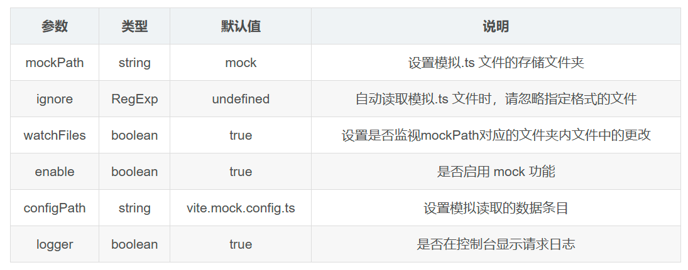

## Vite环境配置

以下是实际项目中常用的 Vite 配置结合环境区分的最佳实践：

---

### 一、环境配置核心方案
1. **环境变量文件**  
   
   - **开发环境**：`.env.development`  
     ```env
     VITE_API_URL=http://dev-api.example.com
     VITE_MOCK_ENABLED=true
     ```
   - **生产环境**：`.env.production`  
     ```env
     VITE_API_URL=https://prod-api.example.com
     VITE_MOCK_ENABLED=false
     ```
   - **测试环境**：`.env.test`  
     ```env
     VITE_API_URL=http://test-api.example.com
     ```
   - **全局默认**：`.env`（所有环境共享）
   
2. **变量命名规则**  
   - 仅以 `VITE_` 开头的变量会暴露给客户端代码，其他变量仅在构建时可用  
   - 示例：`VITE_APP_TITLE=生产环境`

3. **环境切换命令**  
   ```json
   "scripts": {
     "dev": "vite --mode development",
     "build": "vite build --mode production",
     "test": "vite --mode test",
     "preview": "vite preview --mode production"
   }
   ```
   - 通过 `--mode` 指定加载的环境文件

---

### 二、常用插件与配置
| 插件/配置                   | 用途                        | 环境适用性 | 示例配置                    |
| --------------------------- | --------------------------- | ---------- | --------------------------- |
| **@vitejs/plugin-vue**      | 支持 Vue 单文件组件         | 所有环境   | 基础配置必选                |
| **vite-plugin-mock**        | 本地 Mock 数据              | 开发环境   | 仅在开发环境启用 Mock       |
| **vite-plugin-compression** | Gzip/Brotli 压缩            | 生产环境   | 构建时自动压缩静态资源      |
| **vite-plugin-inspect**     | 分析构建产物依赖关系        | 开发环境   | 调试优化使用                |
| **vite-plugin-pwa**         | 渐进式 Web 应用支持         | 生产环境   | 配合 `workbox` 实现离线缓存 |
| **vite-plugin-test**        | 集成测试框架（Vitest/Jest） | 测试环境   | 配置测试环境专用变量        |

---

### 三、动态配置示例（`vite.config.js`）
```javascript
import { defineConfig, loadEnv } from 'vite'
import vue from '@vitejs/plugin-vue'
import mockDevPlugin from 'vite-plugin-mock'

export default defineConfig(({ mode }) => {
  const env = loadEnv(mode, process.cwd(), 'VITE_') // 加载环境变量

  return {
    plugins: [
      vue(),
      mode === 'development' && mockDevPlugin() // 仅开发环境启用 Mock
    ],
    server: {
      proxy: {
        '/api': {
          target: env.VITE_API_URL, // 动态切换代理目标
          changeOrigin: true
        }
      }
    },
    build: {
      sourcemap: mode === 'development', // 开发环境启用 Sourcemap
      rollupOptions: {
        output: {
          assetFileNames: `assets/[name].[hash].[ext]`
        }
      }
    }
  }
})
```

---

### 四、最佳实践与注意事项
1. **安全规范**  
   - 敏感信息（如数据库密码）不应通过 `VITE_` 前缀暴露给前端，应通过服务端接口中转
   - 使用 `.env.local` 存储本地敏感配置，并加入 `.gitignore`

2. **类型支持**  
   ```typescript
   // env.d.ts
   interface ImportMetaEnv {
     readonly VITE_API_URL: string
     readonly VITE_APP_TITLE: string
   }
   ```
   声明环境变量类型以增强开发体验

3. **构建优化**  
   - 生产环境关闭 Sourcemap 以减小包体积
   - 使用 `vite-plugin-compression` 压缩静态资源

4. **环境隔离策略**  
   - **开发环境**：启用 HMR、Mock 数据、调试工具  
   - **测试环境**：使用独立 API 地址，关闭 Mock  
   - **生产环境**：启用代码压缩、CDN 路径配置

---

### 五、典型场景配置对比
| 功能项        | 开发环境                    | 生产环境                  | 测试环境                      |
| ------------- | --------------------------- | ------------------------- | ----------------------------- |
| **API 地址**  | `http://localhost:3000/api` | `https://api.example.com` | `http://test-api.example.com` |
| **Mock 数据** | 启用                        | 禁用                      | 可选启用                      |
| **Sourcemap** | 启用                        | 禁用                      | 禁用                          |
| **压缩策略**  | 不压缩                      | Gzip + Brotli             | 按需压缩                      |

通过合理配置环境变量和插件组合，可实现高效的多环境开发工作流。完整配置参考 Vite 官方文档及上述来源。

## vite插件使用

以下是 Vite 生态中使用频率最高的 **30 个插件**，涵盖官方推荐和社区热门插件，按功能分类并附配置示例与使用场景说明。插件列表综合了多个技术博客和开发者社区的实践反馈（引用来源见文末）。

---

### 简要概述

#### **一、开发效率类**

1. **@vitejs/plugin-vue**  
   - **用途**：Vue 单文件组件支持（官方插件）  
   - **配置**：  
     ```javascript
     import vue from '@vitejs/plugin-vue';
     export default defineConfig({ plugins: [vue()] });
     ```

2. **unplugin-vue-components**  
   - **用途**：UI 组件自动按需导入（支持 Element Plus、Ant Design 等）  
   - **配置**：  
     ```javascript
     import Components from 'unplugin-vue-components/vite';
     import { ElementPlusResolver } from 'unplugin-vue-components/resolvers';
     plugins: [Components({ resolvers: [ElementPlusResolver()] })];
     ```

3. **unplugin-auto-import**  
   - **用途**：自动导入 Vue、Vue Router 等 API，无需手动引入  
   - **配置**：  
     ```javascript
     import AutoImport from 'unplugin-auto-import/vite';
     plugins: [AutoImport({ imports: ['vue', 'vue-router'] })];
     ```

4. **vite-plugin-restart**  
   - **用途**：监听配置文件修改后自动重启服务，提升开发效率  
   - **配置**：  
     ```javascript
     import ViteRestart from 'vite-plugin-restart';
     plugins: [ViteRestart({ restart: ['vite.config.js'] })];
     ```

5. **vite-plugin-mock**  
   - **用途**：本地 Mock 数据服务，支持真实请求记录  
   - **配置**：  
     ```javascript
     import { viteMockServe } from 'vite-plugin-mock';
     plugins: [viteMockServe({ mockPath: 'mock' })];
     ```

---

#### **二、性能优化类**
6. **vite-plugin-compression**  
   - **用途**：Gzip/Brotli 压缩静态资源，优化生产包体积  
   - **配置**：  
     ```javascript
     import viteCompression from 'vite-plugin-compression';
     plugins: [viteCompression({ algorithm: 'gzip' })];
     ```

7. **rollup-plugin-visualizer**  
   - **用途**：打包体积分析，生成可视化报告  
   - **配置**：  
     ```javascript
     import { visualizer } from 'rollup-plugin-visualizer';
     plugins: [visualizer()];
     ```

8. **vite-plugin-imagemin**  
   - **用途**：图片压缩（支持 PNG、JPEG、GIF）  
   - **配置**：  
     ```javascript
     import viteImagemin from 'vite-plugin-imagemin';
     plugins: [viteImagemin({ mozjpeg: { quality: 80 } })];
     ```

9. **vite-plugin-pwa**  
   - **用途**：渐进式 Web 应用支持，实现离线缓存  
   - **配置**：  
     ```javascript
     import { VitePWA } from 'vite-plugin-pwa';
     plugins: [VitePWA({ registerType: 'autoUpdate' })];
     ```

---

#### **三、UI 库与静态资源**
10. **vite-plugin-style-import**  
    - **用途**：解决 UI 库样式按需加载问题（如 Element Plus 的 Message 组件）  
    - **配置**：  
      ```javascript
      import styleImport from 'vite-plugin-style-import';
      plugins: [styleImport({ resolves: [ElementPlusResolve()] })];
      ```

11. **vite-plugin-svg-icons**  
    - **用途**：SVG 雪碧图生成，支持动态加载  
    - **配置**：  
      ```javascript
      import { createSvgIconsPlugin } from 'vite-plugin-svg-icons';
      plugins: [createSvgIconsPlugin({ iconDirs: ['src/assets/svg'] })];
      ```

12. **vite-plugin-html**  
    - **用途**：动态修改 HTML 模板（如注入环境变量）  
    - **配置**：  
      ```javascript
      import { createHtmlPlugin } from 'vite-plugin-html';
      plugins: [createHtmlPlugin({ inject: { data: { title: 'My App' } } })];
      ```

---

#### **四、框架与工具链**
13. **vite-plugin-vue-i18n**  
    - **用途**：Vue 国际化支持，自动生成语言包  
    - **配置**：  
      ```javascript
      import VueI18nPlugin from '@intlify/unplugin-vue-i18n/vite';
      plugins: [VueI18nPlugin({ include: 'src/locales/**' })];
      ```

14. **vite-plugin-dts**  
    - **用途**：为 TypeScript 项目生成声明文件  
    - **配置**：  
      ```javascript
      import dts from 'vite-plugin-dts';
      plugins: [dts({ include: ['src'] })];
      ```

---

#### **五、其他高频插件**
| 插件名称              | 用途                            | 引用来源 |
| --------------------- | ------------------------------- | -------- |
| `vite-plugin-inspect` | 调试构建过程，查看中间产物      |          |
| `vite-plugin-checker` | 实时 TypeScript/ESLint 错误检查 |          |
| `vite-plugin-babel`   | Babel 转译支持                  |          |
| `vite-plugin-vitest`  | 集成 Vitest 测试框架            |          |
| `vite-plugin-banner`  | 为产物添加注释头（如 License）  |          |
| `vite-plugin-fonts`   | 自动加载 Google Fonts 等字体    |          |

---

#### **插件使用原则**
1. **执行顺序控制**：通过 `enforce: 'pre'` 或 `enforce: 'post'` 调整插件加载顺序  
2. **按需引入**：开发环境插件（如 Mock）需通过 `mode` 判断是否启用  
3. **类型支持**：搭配 `env.d.ts` 声明环境变量类型，避免 TypeScript 报错  

完整插件列表及配置示例可参考 [Vite 官方文档](https://vitejs.dev/plugins/) 或上述来源。

### vite-plugin-mock

#### 一、安装依赖mockjs、vite-plugin-mock

```java
npm i mockjs vite-plugin-mock --save-dev
```

#### 二、vite.config.ts 文件中配置

```javascript
// vite.config.ts
import { defineConfig } from 'vite'
import { viteMockServe } from 'vite-plugin-mock'
import vue from '@vitejs/plugin-vue'

export default defineConfig(({ command }) => {
  return {
    plugins: [
      vue(),
      viteMockServe({
        mockPath: 'mock', // mock文件夹路径
        enable: command === 'serve' // 只有开发环境才开启mock
      }),
    ],
  }
})

```

- viteMockServe 配置

```javascript
{
    mockPath?: string;
    ignore?: RegExp | ((fileName: string) => boolean);
    watchFiles?: boolean;
    enable?: boolean;
    ignoreFiles?: string[];
    configPath?: string;
    logger?:boolean;
}

```



#### 三、在根目录下创建mock文件

项目文件夹下新建mock文件夹，用于存放本地mock文件

```javascript
// mock/user.ts

const createUserList = () => {
    return [
        {
            userId: 1,
            avatar: 'https://pic1.zhimg.com/80/v2-083faf550543c1e9f134b56b3322ee3c_720w.webp',
            username: 'admin',
            password: '123456789',
            desc: '下船不谈船里事',
            roles: ['平台管理员'],
            buttons: ['cuser.detail'],
            routes: ['home'],
            token: 'Admin Token'
        },
        {
            userId: 2,
            avatar: 'https://pic1.zhimg.com/80/v2-e1427f6a21122ac163ff98d24f55d372_720w.webp',
            username: 'system',
            password: '123456789',
            desc: '旧人不谈近况，新人不讲过往',
            roles: ['系统管理员'],
            buttons: ['cuser.detail', 'cuser.user'],
            routes: ['home'],
            token: 'Admin Token'
        }
    ]
}
export default [
    // 用户登录接口
    {
        url: '/api/user/login',
        method: 'post',
        response: ({ body }: any) => {
            // 获取请求体携带过来的用户名与密码
            const { username, password } = body
            // 调用获取用户信息函数，用于判断是否有此用户
            const checkUser = createUserList().find(
                (item) => item.username === username && item.password === password
            )
            // 没有用户则返回失败信息
            if (!checkUser) {
                return {
                    code: 201,
                    data: {
                        message: '账号或者密码不正确'
                    }
                }
            }
            // 如果有返回成功信息
            const { token } = checkUser
            return {
                code: 200,
                data: {
                    token
                }
            }
        }
    },
    // 获取用户信息接口
    {
        url: '/api/user/info',
        method: 'get',
        response: (request: any) => {
            // 获取请求头携带的 token
            const token = request.headers.token
            // 查看用户信息数据中是否包含有此 token 的用户
            const checkUser = createUserList().find((item) => item.token === token)
            // 没有就返回失败信息
            if (!checkUser) {
                return {
                    code: 201,
                    data: {
                        message: '获取用户信息失败'
                    }
                }
            }
            // 有就返回成功信息
            return {
                code: 200,
                data: {
                    checkUser
                }
            }
        }
    }
]

```

#### 四、编写api接口调用文件

##### 1、src文件夹下新建utils/request.ts

```javascript
// utils/request.ts

import axios from "axios";

//创建一个axios实例
const request = axios.create({
    baseURL: '',
    timeout: 20000,
});


// 添加请求拦截器
request.interceptors.request.use(
    function (config) {
        // 请求地址携带时间戳
        const _t = new Date().getTime()
        config.url += `?${_t}`
        
        // 请求头携带token
        config.headers['token'] = localStorage.getItem('token') || ''

        // 在发送请求之前做些什么
        // console.log('我要准备请求啦------')
        // console.log(config, '请求配置')
        
        return config;
    },
    function (error) {
        // 对请求错误做些什么
        return Promise.reject(error);
    }
);

// 添加响应拦截器
request.interceptors.response.use(
    function (response) {
        // 对响应数据做点什么
        // console.log('我接收到响应数据啦------')
        // console.log(response, '响应配置')
        if (response.status === 200) {
            return Promise.resolve(response.data)
        } else {
            return Promise.reject(response)
        }
    },
    function (error) {
        // 对响应错误做点什么
        if (error && error.response) {
            switch (error.response.status) {
                case 400:
                    error.message = '错误请求';
                    break;
                case 401:
                    error.message = '未授权，请重新登录';
                    break;
                case 403:
                    error.message = '拒绝访问';
                    break;
                case 404:
                    error.message = '请求错误,未找到该资源';
                    break;
                case 405:
                    error.message = '请求方法未允许';
                    break;
                case 408:
                    error.message = '请求超时';
                    break;
                case 500:
                    error.message = '服务器端出错';
                    break;
                case 501:
                    error.message = '网络未实现';
                    break;
                case 502:
                    error.message = '网络错误';
                    break;
                case 503:
                    error.message = '服务不可用';
                    break;
                case 504:
                    error.message = '网络超时';
                    break;
                case 505:
                    error.message = 'http版本不支持该请求';
                    break;
                default:
                    error.message = `未知错误${error.response.status}`;
            }
        } else {
            error.message = "连接到服务器失败";
        }
        return Promise.reject(error);
    }
);


/*
 *  get请求:从服务器端获取数据
 *  url:请求地址
 *  params:参数
 * */
export function get(url:string, params = {}) {
    return new Promise((resolve, reject) => {
        request({
            url: url,
            method: 'get',
            params: params
        }).then(response => {
            resolve(response);
        }).catch(error => {
            reject(error);
        });
    });
}

/*
 *  post请求:向服务器端提交数据
 *  url:请求地址
 *  params:参数
 * */
export function post(url:string, params = {}) {
    return new Promise((resolve, reject) => {
        request({
            url: url,
            method: 'post',
            data: params
        }).then(response => {
            resolve(response);
        }).catch(error => {
            reject(error);
        });
    });
}

// 对外暴露请求方法
export default {
    get,
    post
}

```

##### 2、src文件夹下新建api/user.ts

```javascript
// api/user.ts

import { get, post } from './request';

const api = {
    login: '/api/user/login',
    users: '/api/user/info'
}

//登录
export const login = (params: any) => {
    return post(api.login, params).then((res: any) => {
        if (res.code === 200) {
            localStorage.setItem('token', res.data.token);
        }
        return Promise.resolve(res);
    })
}


//获取用户信息
export const getUserInfo = () => {
    const token = localStorage.getItem('token');
    if (!token) return Promise.reject(new Error('用户未登录'));
    return get(api.users);
}

```

#### 五、业务页面调用

```vue
// App.vue

import { onBeforeMount } from 'vue'
import {login,getUserInfo} from "./utils/user"

onBeforeMount(async () => {
  // 登录
  const user = await login({
    username: 'admin',
    password: '123456789'
  })
  console.log(user)
  
  // 获取用户信息
  const users = await getUserInfo()
  console.log(users)
})

```

#### 六、Mock的用法规则

```json
import mockJS from 'mockjs'

const userList = mockJS.mock({
    // 属性 list 的值是一个数组，其中含有 1 到 10 个元素
    'list|1-10': [
        {
            // 随机生成id号
            id: '@id',
            // 随机生成中文姓名
            name: '@cname',
            // 属性 id 是一个自增数，起始值为 1，每次增 1
            'id|+1': 1,
            // 随机生成ip地址
            ip: '@ip',
            // 随机生成省市区地址
            address:'@county(true)',
            // 随机生成邮政编码
            zip:'@zip',
            // 随机生成18-70之间的年龄
            "age|18-70": 20,
            // 随机生成日期
            date: '@date("yyyy-MM-dd")',
            // 随机生成头像
            avatar:"@image('200x200')",
        }
    ]
})

```

