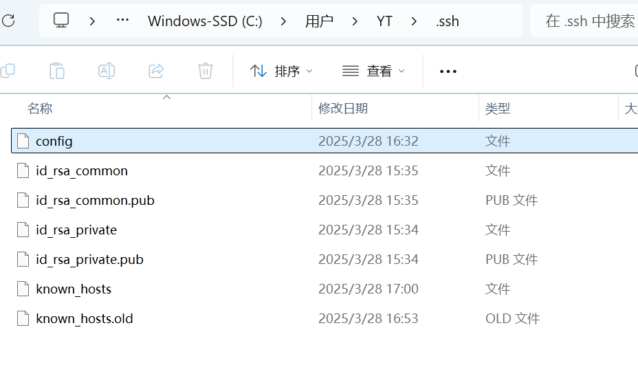

## 项目初始化配置

### 创建github仓库

#### 创建SSHKey

在用户主目录下，使用以下命令生成 SSH Key

```bash
 ssh-keygen -t rsa -C "youremail@example.com"
```

生成的 SSH Key 会保存在 *~/.ssh* 目录下，其中 *id_rsa* 是私钥，*id_rsa.pub* 是公钥

#### 配置 GitHub

将生成的公钥添加到 GitHub。登录 GitHub，进入 *Account settings* -> *SSH and GPG keys*，点击 *New SSH key*，将 *id_rsa.pub* 的内容粘贴进去

在终端中输入以下命令验证是否成功连接：

```bash
ssh -T git@github.com
```

## 配置多git账号与多ssh

### 1.本地打开cmd，生成不同的ssh密钥

```bash
ssh-keygen -t rsa -C "account1@example.com" -f ~/.ssh/id_rsa_private

ssh-keygen -t rsa -C "account2@example.com" -f ~/.ssh/id_rsa_common
```

### 2.在git账号中配置对应的ssh密钥

### 3.修改config文件



添加以下代码

```bash
## Account 1
Host private
  HostName github.com
  User git
  IdentityFile ~/.ssh/id_rsa_private

## Account 2
Host common
  HostName github.com
  User git
  IdentityFile ~/.ssh/id_rsa_common
```

### 4.打开git bash

```bash
 eval "$(ssh-agent -s)"

ssh-add ~/.ssh/id_rsa_private

ssh-add ~/.ssh/id_rsa_common

#查看是否配置过全局账号
ssh-add ~/.ssh/id_rsa_private
#清除全局
git config --global --unset user.name
git config --global --unset user.email

#测试配置是否成功
ssh -T git@common
ssh -T git@private
```

### 5.打开本地项目，配置git用户名和账号，设置别名url

```bash
git config --local user.email blueblueblueuiiy@outlook.com
git config --local user.name pinkbluerabbit

##本地仓库连接远程
git remote add origin git@github.com:pinkbluerabbit/testProject.git
#设置别名url
git remote set-url origin git@common:pinkbluerabbit/testProject.git
```

==注意！！！！不能开watt上传git，会出现端口错误==

## 本地项目连接远程仓库

在本地文件夹路径下创建git

```bash
git init
```

已经创建了本地仓库，开始关联 GitHub 远程仓库

```bash
git remote add origin git@github.com:yourName/repositoryname.git
```

(`origin`是仓库别名)

`git remote -v` 确认是否添加成功

推送文件到远程

```bash
git push -u origin <分支名>
```

## 从远程仓库自动创建本地项目

```bash
git clone <远程仓库>
```

## 文件提交与拉取

提交内容

```bash
git add .   //或者<文件名>添加单个文件
git commit -m "提交说明"
git push -u <仓库名> <分支名>
```

拉取内容

```bash
#git fetch是将远程主机的最新内容拉到本地，用户在检查了以后决定是否合并到工作本机分支中
git fetch <仓库名> <分支名>  #仓库名、分支名均可省略
git merge    #或者git rebash

#或者
git pull <仓库名> <远程分支名>:<本地分支名>
```

## 工作区暂存与应用

### 暂存未提交的修改

默认情况下，`git stash`会缓存下列文件：

- 添加到暂存区的修改（staged changes）
- Git跟踪的但并未添加到暂存区的修改（unstaged changes）

但不会缓存一下文件：

- 在工作目录中新的文件（untracked files）
- 被忽略的文件（ignored files）

`git stash`命令提供了参数用于缓存上面两种类型的文件。使用`-u`或者`--include-untracked`可以stash untracked文件。使用`-a`或者`--all`命令可以stash当前目录下的所有修改

```bash
git stash save "记录message"

#或者
git stash
```

```bash
git stash pop  #恢复之前缓存的工作目录，将缓存堆栈中的第一个stash删除，并将对应修改应用到当前的工作目录下

#或者
git stash apply #将缓存堆栈中的stash多次应用到工作目录中，但并不删除stash拷贝
```

### 从stash创建分支

```bash
git stash branch
```

## 分支管理

```bash
#查看分支 
git branch -a
#新建分支并切换
git checkout -b <branch>
#新建分支
git checkout <branch>
#切换分支
git branch <branch>

#删除分支 
git branch -d 分支名
#删除远程分支 
git push origin --d 分支名
## 切换到远程分支并创建本地分支
git checkout -b new-branch origin/remote-branch
```

## 撤销命令

```bash
#未使用git add时，撤销工作区的文件修改
git checkout -- filepathname //放弃修改某个文件
git checkout .  //放弃所有修改的文件
git restore . //放弃所有修改的文件

#git reset （撤销工作区/暂存区的文件，会丢失提交记录，只适用于回退本地修改）
git reset --soft <commit_id>     #回退HEAD
git reset --mixed <commit_id>    #回退HEAD和暂存区
git reset --hard <commit_id>     #回退HEAD，暂存区和工作区

#生成一个撤销指定版本的新提交，用于撤销公共提交
git revert <commit_id>
#将指定的提交应用于当前分支，用于恢复不小心撤销的提交
git cherry-pick <commit_id> 
```


## 追溯文件修改记录

### git blame

**git blame用来追溯一个指定文件的历史修改记录**

git blame用来追溯一个指定文件的历史修改记录。它能显示任何文件中**每行最后一次修改**的提交记录。 

命令用法：

```cpp
git blame filename
```

可以使用 -L 指定文件的行数范围：

```cpp
git blame -L n1,n2 filename
```

1. git blame的具体显示格式是：

2. ```cpp
   commit ID  (代码提交作者  提交时间  代码位于文件中的行数)  实际代码
   ```

### git show

**git show 命令用于显示各种类型的对象，对于提交，它显示日志消息和文本差异，对于标签，它显示标签消息和引用对象。**

#### 语法

```
git show [options] <object>
```

#### 参数

| 参数    | 描述                      |
| :------ | :------------------------ |
| options | git show 命令使用的选项。 |
| object  | 需要查看的对象。          |